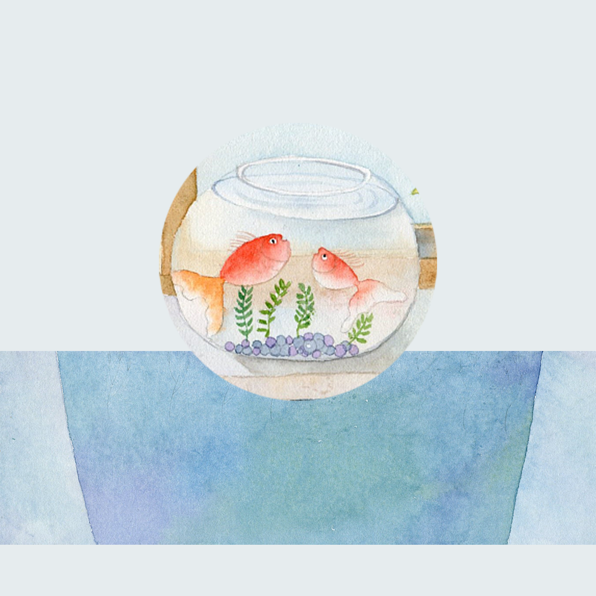

## Welcome to Fish And My Precious Record

It's fun and meaningful to be with your own fish, each with different characteristics and preferences. You can keep a precious record of yourself playing with the fish. You can keep a record of your fish's name, number and color. You can also record the fish's preferred living environment, such as seaweed, pebbles, etc. Keep a record of all your experiences with the fish as your precious memories and records to share with your family and friends.

If you have any questions, you can either leave a message or send the questions to our email address.

We will answer them for you in the first time.

### Address: HaydenDarrenpRrU@yahoo.com

Thank you!
